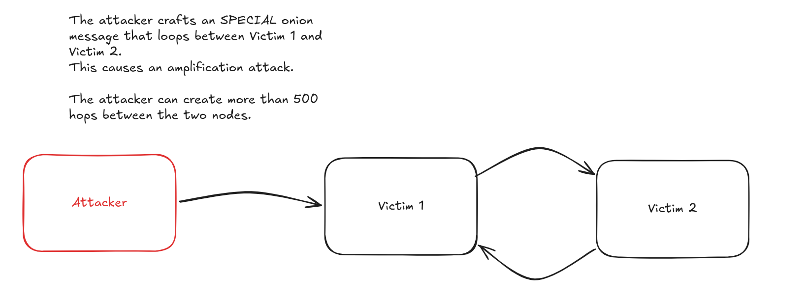

BOLT 12 is almost fully deployed. Onion message forwarding is on every major node, which is great for offers, invoice requests, and async payments. But the same rate limits that make a node survive flooding are exactly what makes flooding effective against the *network*.

I want to walk through the attack (including an amplification trick I keep coming back to) and then through the four mitigations I think are worth taking seriously. Most of this comes out of the Lightning spec meeting on March 9th, 2026, plus the reading I did afterwards.

## what we ship today

BOLT 4 admits onion message routing is unreliable and waves at rate limiting. Most implementations also only relay messages from peers they share a channel with. The rough state of the world:

- **Core Lightning:** token bucket, 4 msg/s/peer, warn-and-drop.
- **Eclair:** hard cap of 10 msg/s/peer, channel peers only.
- **LDK:** no strict rate limit; deprioritizes onion messages behind channel traffic, max 32 per tick when the outbound buffer is empty.
- **LND:** per-peer mailbox of 50 with random early drop starting at 80% full. An [open PR](https://github.com/lightningnetwork/lnd/pull/10713) adds a two-tier (per-peer and global) ingress token bucket and restricts forwarding to channel peers.

All of these protect the node. None protect the network. None of them implement t-bast's backpropagation idea (more on that below).

TTLs came up at the March 9th meeting too, mostly as a replay defense. They don't help here: the attacker generates fresh messages, not replays.

## the attack

The rate limit *is* the attack surface. An attacker spins up nodes, opens channels, floods. Each intermediate hop costs ~86 bytes of payload ([derivation](#annex-a-maximum-hop-count-derivation)). BOLT 4 suggests packet sizes of 1,366 bytes (16 hops) and 32,834 bytes (382 hops), but doesn't enforce a max. The real ceiling is Noise's 65,535-byte message limit, which gets you **761 hops in a single message**.

Now the fun part. Because onion messages use source routing and an intermediate hop can't see the full path, the attacker can craft a route that bounces back and forth between two victims:

> Victim 1 → Victim 2 → Victim 1 → Victim 2 → ...

A worst-case message can bounce 500+ times between two nodes. Each victim sees the *other* as the source of the flood, so per-peer rate limiting kicks in between the two honest nodes. One message, asymmetric damage on a link the attacker never directly touches.

## what to do about it

Capping the hop count helps but doesn't fix anything on its own; the attacker just opens more entry points. Tor's experience suggests hop caps are still worth doing as a cost multiplier, paired with something else. Here are the four "something elses" I find most plausible.

### upfront fees

Charge per hop. Carla Kirk-Cohen's [upfront HTLC fee proposal](https://github.com/lightning/bolts/pull/1052), originally aimed at fast channel jamming, generalizes cleanly to onion messages, which is appealing because we don't end up with two parallel anti-jamming systems.

For HTLCs, nodes advertise an unconditional fee as a percentage of their success-case fees (simulations land on 1%, capped at 10% to keep nodes from intentionally failing payments to harvest the upfront portion). For onion messages, they advertise a flat per-message fee instead, encoded in the per-hop payload and deducted at each hop. If the fee for the next hop is too low, drop the message. The flip side: under a flooding attack, the targeted nodes *make money* forwarding.

Settlement piggybacks on the channel state machine (`commitment_signed`/`revoke_and_ack`); no new HTLCs needed. The onion message is effectively an implicit channel state update. This also makes "only forward to channel peers" a hard requirement, since peers without a channel can't settle the fee.

The catch is latency. Today, forwarding is 0.5 RTT: `onion_message ->`. With upfront fees, it's ~1.5 RTT, dropping to ~1.0 if you piggyback the trailing `revoke_and_ack` on the next outgoing onion message. Call it 2x latency, plus a stateful relay where today's is stateless. A sufficiently funded attacker still wins; it just costs them.

References: [bolts#1052](https://github.com/lightning/bolts/pull/1052), [Unjamming Lightning](https://eprint.iacr.org/2022/1454.pdf).

### proof-of-stake forwarding (with a hop leash)

[Bashiri and Khabbazian, FC 2024](https://ualberta.scholaris.ca/items/245a6a68-e1a6-481d-b219-ba8d0e640b5d) propose two things together.

**Cap the hops.** Either a *hard leash* (e.g., 3 hops, the Tor floor) or a *soft leash* where the sender solves a PoW that gets exponentially harder per hop, with each node advertising a difficulty target via gossip. Soft leash is nice because it doesn't change the onion format.

**Tie rate limits to capital.** Per-peer rate limits become proportional to the peer's gossip-visible channel capacity: `α × F_B`. Well-capitalized nodes get high quotas, attacker nodes get crumbs. The paper argues an adversary needs a meaningful fraction of total network funds to degrade service.

The cost: a 3-hop limit shrinks the sender's anonymity set, and Lightning's hub-heavy topology already leaks origin information faster than Tor does. Proof-of-stake leans toward big established nodes; lock-capital-to-buy-throughput is the obvious griefing path. And nodes with only private channels have zero gossip-visible capacity, which means zero quota, which means they can't forward at all. That's exactly the privacy-conscious and mobile users you'd want onion messaging to support.

### bandwidth-metered sessions

[roasbeef's proposal](https://lists.linuxfoundation.org/pipermail/lightning-dev/2022-February/003498.html) is HORNET-inspired: pay once, send many.

The sender sends an AMP payment that drops fees at each hop (priced via `sats_per_byte` and `sats_per_block` rates in `node_announcement`) along with a 32-byte `onion_session_id` and an expiry height. The recipient accepts by pulling the payment. After that, the sender just includes the session ID in `encrypted_data_tlv` and forwarders check bandwidth before relaying, costing ~40 bytes of per-session state per hop.

Like upfront fees, this makes flooding cost money. Unlike upfront fees, the cost is paid once per session and amortized across many messages, so setup is expensive but steady-state is cheap.

The tradeoffs are the new state and a small linkability surface: at a single hop, messages sharing a session ID become correlatable. The sender can rotate session IDs per hop, so a colluding pair can't trivially join across hops, but link-local correlation is still a step away from the stateless ideal.

### backpropagation-based drops

[t-bast's `onion_message_drop`](https://lists.linuxfoundation.org/pipermail/lightning-dev/2022-June/003623.html) is the cheapest of the four: no payments, no PoW, no new accounting.

Each node remembers the `node_id` of the last sender per outgoing connection. When a downstream peer goes over its limit, it sends an `onion_message_drop` back upstream. The upstream node halves the rate it gives the suspected source and relays the drop further back. If the source stops misbehaving, the rate doubles every 30 seconds until it returns to default. A `shared_secret_hash` (BIP 340 tagged hash of the Sphinx shared secret) lets the original sender recognize their own drop bouncing back and retry along a different path.

Cheap, but reactive: legitimate users feel the squeeze before backpressure converges. Storing only the *last* `node_id` per outgoing link means drops sometimes hit the wrong peer (statistically still mostly right). A malicious node can forge drops to suppress competitors. And it's particularly weak against bounce amplification: that attack is *designed* to make two honest nodes blame each other, which is exactly the signal backpropagation amplifies.

## where I land

Each mitigation hits a different piece. Upfront fees and metered sessions both make flooding expensive, just on different schedules: per-message and stateless vs. per-session and stateful. Hop-leash plus proof-of-stake limits attacker reach by tying quota to capital. Backpropagation is the cheap, deployable defense that doesn't require any payment plumbing.

LND's onion message forwarding PR just merged. Once it ships, every major implementation supports BOLT 12 forwarding, and the attack surface expands accordingly. If onion messages become the standard transport for offers, invoice requests, refunds, and async payments, a sustained jamming campaign would translate directly into broken UX.

Channel jamming is the cautionary tale: once a vulnerability is well-established, retrofitting a fix is slow even when the proposals exist. Tor learned this the hard way during the [2022 DDoS](https://blog.torproject.org/tor-network-ddos-attack/), patching under pressure for months. With BOLT 12 not yet fully online, we still have a window to design and ship something *before* the surface is fully exposed. I think we should use it.

*Thanks to Matt Morehouse and Gijs van Dam for reviewing drafts.*

---

## annex a: maximum hop count derivation

Each intermediate hop costs 86 bytes:

| Component | Bytes |
|---|---|
| BigSize length prefix | 1 |
| `encrypted_recipient_data` TLV wrapper | 2 |
| Encrypted blob (35-byte ChaCha20-Poly1305 ciphertext + 16-byte Poly1305 tag) | 51 |
| HMAC | 32 |
| **Total** | **86** |

Noise caps a message at 65,535 bytes. The Lightning header eats 37 bytes (message type + blinding point + length prefix), the onion header eats 66 bytes (version + public key + HMAC), leaving **65,432 bytes** for hop data:

| Packet size | Hop data | Intermediate | + Final | **Total hops** |
|---|---|---|---|---|
| 1,366 (suggested) | 1,300 | 15 | 1 | **16** |
| 32,834 (suggested) | 32,768 | 381 | 1 | **382** |
| **65,535 (worst case)** | **65,432** | **760** | **1** | **761** |
